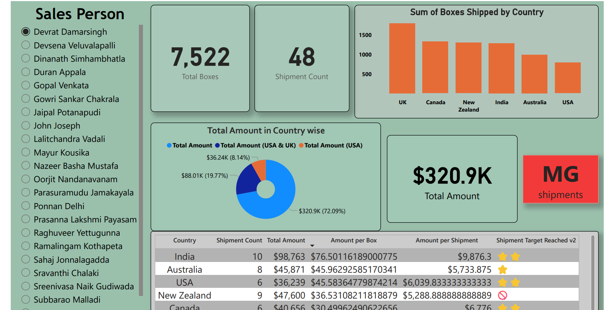

# Chocolate Sales Power BI Dashboard

## 📊 Project Overview
This project analyzes chocolate sales data across different countries using Power BI.

## 🔧 Tools Used
- Power BI

## 📈 Key Insights
- Total Sales: $320.9K
- Total Shipments: 48
- Total Boxes Shipped: 7,522

- UK has highest shipments
- India generated highest revenue (~$98K)
- New Zealand did not reach shipment target

## 🌍 Features
- Country-wise sales analysis
- Shipment performance tracking
- Sales person filter
- KPI cards

## 📷 Dashboard Preview

## 🚀 Conclusion
This dashboard helps identify top-performing regions and shipment efficiency.
